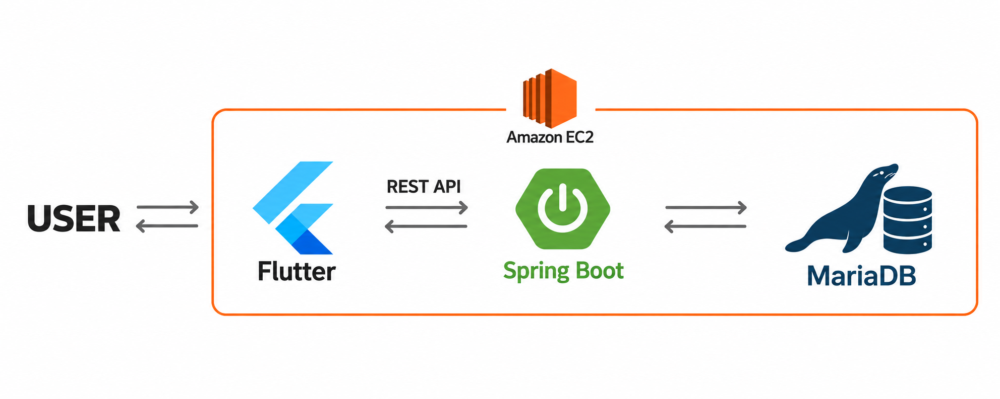

# Jiki

**약속 참여 여부와 도착 상태에 따른 벌금·보상 정산 서비스**

**담당 역할**　백엔드 개발 · 팀장  
**기술**　Java 17, Spring Boot, Spring Security, JWT, Spring Data JPA, MariaDB, AWS EC2  
**GitHub**　[CapstoneDesign-timeisgold/Back](https://github.com/CapstoneDesign-timeisgold/Back)

### 시스템 구조

### 핵심 기능

**약속 관리** - 친구 요청부터 약속 생성, 초대 수락·거절, 참여 취소까지 처리. 참여 마감 이후에는 변경을 제한하고, 수락한 참여자만 정산 대상으로 확정.

**정산** - 도착 상태에 따라 벌금과 보상을 계산하고 잔액·개인 거래 내역에 반영. 실제 결제가 아닌 서비스 내부 정산 시뮬레이션.

### 문제 해결

#### 1. 요청자 위조와 권한 없는 정산 접근 차단

요청 본문의 사용자명 대신 JWT 인증 정보로 요청자를 식별하도록 변경. 정산은 약속 생성자만 실행할 수 있고, 결과는 생성자와 수락한 참여자만 조회할 수 있도록 권한 검사 추가. 타인의 요청을 처리하거나 정산에 접근하는 경우를 차단하는 테스트 작성.

#### 2. 참여 상태와 정산 시점의 불일치 방지

대기·거절 상태의 사용자까지 정산에 포함되던 문제를 수정하고, `ACCEPTED` 참여자만 계산에 포함. 예정 시각 전 정산은 `409 Conflict`로 차단. 새 방식으로 완료된 정산의 재시도는 금액을 다시 반영하지 않고 정상 응답하며, 대상 필터링과 미래 약속의 정산 거절에 대한 테스트 작성.

#### 3. 참여 변경과 정산의 동시 처리 제어

수락·취소와 정산 요청이 겹쳐도 정산 대상이 바뀌지 않도록 같은 약속 행에 `PESSIMISTIC_WRITE` 잠금을 걸고 처리. 참여 ID로 변경하는 경우에도 약속 잠금 후 참여 행을 다시 조회해 최신 상태 확인.

#### 4. 순환 의존성으로 인한 서버 기동 실패 해결

`SecurityConfig`와 `UserSecurityService`가 `PasswordEncoder`를 통해 순환 참조하면서 서버 기동 실패. 인코더 Bean을 `PasswordConfig`로 분리해 순환 의존성을 제거하고, Java 17·MariaDB 환경에서 정상 기동을 확인한 내용을 기록.

#### 5. 약속 목록 조회의 반복 SQL 제거

- **문제:** 약속 목록을 조회할 때 지연 로딩으로 약속과 생성자를 개별 조회해, 약속 수에 비례하여 SQL과 응답 시간이 증가했다.
- **해결:** 수락 상태 필터를 DB 조회 조건으로 옮기고 약속·생성자를 fetch join으로 함께 조회했다. SQL 횟수를 확인하는 회귀 테스트와 k6 부하 테스트를 추가했다.
- **결과:** 약속 100개 기준 서비스 SQL **202회 → 2회(약 99% 감소)**. VU 10에서 p95 응답 시간의 3회 중앙값은 **58.09ms → 8.81ms(84.8% 감소)**였고, 전후 본 측정 82,405건에서 HTTP 오류와 응답 데이터 불일치가 없었다.

동일 PC의 MariaDB·k6에서 조건별 5초 워밍업 후 10초씩 3회 측정한 결과다. 운영 성능과 구분하며, [개선 기록](back/docs/IMPROVEMENT_LOG.md)에 측정 조건을 정리했다.

#### 6. 정산 금액 보존과 동시 정산 처리

- **문제:** 벌금을 균등 배분한 나머지가 소실되고, 전원 지각 시 관리자 입금이 거래 내역에 남지 않았다. 서로 다른 약속이 같은 계정을 동시에 정산하면 데드락으로 일부 정산이 실패했으며, 완료된 정산의 재시도는 409로 거절됐다.
- **해결:** 나머지를 관리자에게 적립하고 입금 기록을 남겼다. 대상 계정을 사용자 ID 순서로 잠근 뒤 현재 잔액을 읽어, 잔액·거래 기록·확정 결과를 한 트랜잭션으로 저장했다. 반복 요청에는 금액을 다시 반영하지 않고 정상 응답하도록 변경했다.
- **결과:** 1,000원을 3명에게 배분할 때 소실되던 1원이 관리자에게 적립됐다. 동시 정산 20회 실험의 데드락 실패는 **20회 → 0회**였으며 잔액과 기록이 일치했다. k6 VU 10의 100요청 × 3회에서 **300건 모두 정상 응답하고 실제 정산은 약속별 한 번** 유지했다. 일반 테스트 82개도 통과했다.

로컬 MariaDB에서 충돌 시점을 의도적으로 맞춘 정확성 실험이다. 운영 실패율이나 처리량 개선을 뜻하지 않으며, [정산 검증 문서](back/docs/SETTLEMENT_INTEGRITY.md)에 검증 범위를 정리했다.

### 설계와 검증

약속과 참여자를 별도 엔티티로 구분. 참여 마감은 현재 시각 이후부터 약속 시작 시각까지 설정할 수 있으며, 마감 정각부터 초대·수락·거절·취소를 제한. 외부 참여자가 처음 수락하면 별도 플래그로 마감 변경을 잠그고, 이후 취소하거나 재초대해도 잠금을 유지.

권한과 입력값 검사, 중복 초대, 마감 직전·정각·직후, 정산 후 변경 제한을 테스트. MockMvc로 HTTP 응답을 확인하고 H2로 참여 상태와 마감 정보가 저장되는지 검증하도록 작성.
